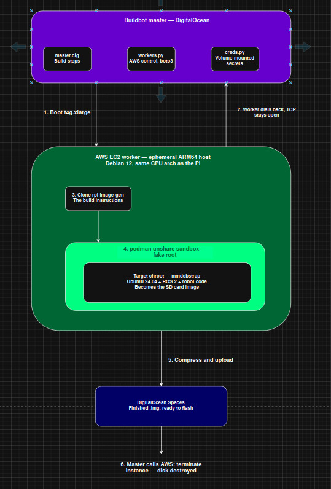

# Ubiquity Robotics Buildbot Orchestrator

This repository contains the infrastructure configuration for the Ubiquity Robotics CI/CD system. It acts as the **"Puppet Master"**, orchestrating the automated builds of Ubuntu/ROS 2 robot images.

> **Note:** This repository only manages the *infrastructure*. The actual scripts and instructions to build the robot images are located in the [rpi-image-gen](https://github.com/UbiquityRobotics/rpi-image-gen) repository.

---

## Architecture Overview

### Architecture Diagram



The system uses a hybrid-cloud Master/Worker architecture:

1.  **The Master (DigitalOcean):** A Docker container running Buildbot. It hosts the Web UI (`https://build.ubiquityrobotics.com`) and manages the build queue. It does **not** compile code itself.
2.  **The Workers (AWS EC2):** When a build is triggered, the Master uses the `boto3` API to dynamically spin up ephemeral AWS EC2 instances (e.g., `t4g.xlarge` ARM64 machines). 
3.  **The Execution:** The AWS workers clone `rpi-image-gen` and use `podman` and `mmdebstrap` to build the target images inside a secure user namespace sandbox.
4.  **The Teardown:** Once the build is completed and the final image is uploaded, the ephemeral AWS EC2 instances are permanently destroyed.

For a deep dive into exactly how this works under the hood, read the [SYSTEM_ARCHITECTURE.md](./SYSTEM_ARCHITECTURE.md).

For information on scaling, caching, and modernization plans, see the [modernization_plan.md](./modernization_plan.md) and [architecture_critique.md](./architecture_critique.md).

---

## Deployment Guide

### Prerequisites
1. Install Ansible on your local workstation:
   `sudo apt install ansible`
2. Authenticate with the Ubiquity DigitalOcean container registry (Ask David or Rohan for the token):
   `docker login -u TOKEN -p TOKEN registry.digitalocean.com`

### Deploying to Production
1. Clone this repository locally:
   `git clone https://github.com/UbiquityRobotics/ubiquity_buildbot.git`
2. Run the deployment script:
   ```bash
   cd ubiquity_buildbot/deploying
   ./deploy.sh
   ```
   **What does `deploy.sh` actually do?** 
   - It runs an Ansible playbook (`ansible.yaml`) that connects to the DigitalOcean droplet via SSH.
   - It copies the latest `master.cfg` and `workers.py` from your local machine to the server.
   - It builds a new Docker image containing Buildbot and its Python dependencies (`boto3`, etc.).
   - It tears down the old Master container and spins up a new one on host network mode, listening on port `8010` (Web UI) and `9989` (Worker connections).

### Managing Secrets (`creds.py`)
Highly sensitive AWS API keys and passwords are **never** committed to this repository. 
When deployed on the DigitalOcean server, the master reads credentials from a local file mounted as a Docker volume at `/opt/buildbot/creds/creds.py`. If you need to update API keys, you must SSH into the DigitalOcean droplet and edit the file directly on the host.

---

## Usage & Triggering Builds

Once deployed, the master will automatically listen for triggers. To manually force a build:
1. Navigate to [https://build.ubiquityrobotics.com](https://build.ubiquityrobotics.com)
2. Go to **Builds** -> **Builders**
3. Select your target builder (e.g., `MICHAEL-TEST-BASE-IMAGE`)
4. Click **Force Build** in the top right.

---

## Debugging

If workers are hanging (e.g., waiting 60 minutes for a connection) or the Master is returning `502 Bad Gateway`:
1. **Check Master Logs:** SSH into the DigitalOcean server and view the Buildbot container logs (`docker logs ubiquity_buildbot`).
2. **Check Port Bindings:** Ensure the Docker container is successfully binding to TCP port `9989` so the AWS workers can connect.
3. **Check AWS EC2 Boot:** If a worker never connects, it usually means the `cloud_init_script` failed during boot. Log into the AWS console, find the specific EC2 instance, and check the System Log for `apt-get` or dependency installation errors.
