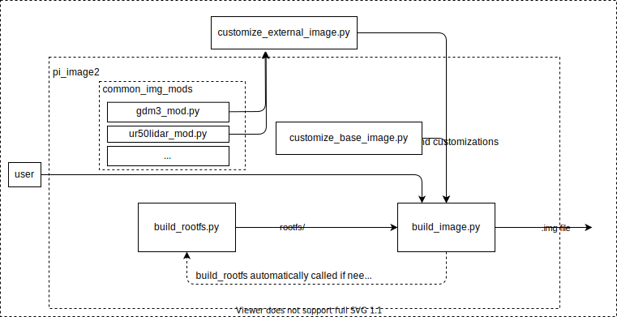

# pi_image2

This is a repo for building Noetic and later images for Raspberry Pi. 
## Building a new image manually
The raspberry pi image build can only be triggered on an ARM machine. You can either configure a local ARM machine (eg. raspberry-pi), sync this repo onto it, install dependencies and trigger the build. Another way is to setup an instance on the AWS server and trigger the build on that. 

### Setting up a build on Raspberry Pi
TODO - its not suggested to do this on RPI as it takes a long time. But it is possible if access to AWS is not available. 

### Setting up a build on AWS server
**Setting up a build machine**

Here is how you configure an AWS instance for building a new image:

https://aws.amazon.com -> `Sign In to the Console` -> Login with account given to you by Admin -> `EC2` -> Launch instances button dropdown -> `Launch instance from template` -> Source template: `image-build-testing` -> `Launch Instance` -> `View Launch Templates` -> Copy `Public IPv4` of your instance (if there is more of them listed, usually the latest one is the bottom of list of Type `t4g.micro` ). The IP is going to be something like for example: `3.129.90.191`

Now open a terminal on your workstation and ssh onto the instance using the `.pem` security file

    ssh -i ~/Downloads/John.pem ubuntu@3.129.90.191

If you don't have a `.pem` security file for aws server, ask Admin to get you one.

You are now able to ssh onto the aws build machine, next is to sync your local `pi_image2` code onto it:

**Syncing code onto the AWS machine**

To sync the code, open a terminal on your workstation and enter:

    rsync -avzhe "ssh -i PATH_TO_PEM/John.pem" /PATH_TO_CODE/pi_image2/ ubuntu@3.129.90.191:pi_image2/

where `PATH_TO_CODE` is the path to your local code files which you want to test building. `PATH_TO_PEM` is path to where you keep you security `.pem` folder.

**Install Dependencies on AWS instance**

Once you are ssh-ed on the AWS instance you may need to install some dependencies that are `pi_image2` specific. (This may be unnecessary on AWS template that has this already pre-installed)

Python dependencies:
  
    sudo pip install pychroot
  
and additionally you need to install debootstrap tool:
  
    sudo apt install debootstrap 
  
**Triggering a new build**

You need to run using root privileges:

    sudo python3 build_image.py --customization_script_path <PATH TO CUSTOMIZATION SCRIPT>
  
This will run `build_image.py` with default settings taken from given customization script. To run script with base image customizations you can run

    sudo python3 build_image.py --customization_script_path customizations/customize_base_image.py

To see other available options run:

    python3 build_image.py -h

In any case, the build will take a while, so you might as well grab a coffee :)

--- 

## How does it all work? (files explained in detail)
Here is a detailed overview of the architecture of the pi_image2 files:

<!-- Diagram can be edited with draw.io using a web editor to edit OR the VSCode draw.io extension -->

1. `build_rootfs.py` - sets up things that are common to ALL UR images:
    - triggers download of specified fresh linux filesystem with debootstrap
    - sets up sources, apt updates/upgrades
    - installs common apt packages
    - sets up user settings
    - sets up common ROS stuff and networking settings
     
   It packages all this and creates a **root filesystem (rootfs)** which is a basis for `build_image.py` to build a workable image from. In normal cases this script does not need to be run by users as it is ran by `build_image.py` if necessary. What is important to note is that this script is the one that prepares the base filesystem that everything else is built upon AND that **if things need to be added to ALL the images, this script is where they would get added**. Note of caution - adding and/or removing stuff here might brake a lot of stuff, so make sure you've tested the changes extensevly before merging to master.

2. `build_image.py` - takes the **rootfs** that `build_rootfs.py` has created and with arguments and parameters from "customization scripts" generates the .img file that can be flashed onto a Raspberry Pi. `build_image.py` can be pointed towards a location from which it takes rootfs through parameter `rootfs` from customization script.

3. **Customization script** is a python scripts that is passed as an argument to `build_image.py`:
   
        sudo python3 build_image.py --customization_script_path <PATH TO CUSTOMIZATION SCRIPT>/minimal_customization_script.py

    These customization scripts fully define what kind of image is going to be generated. They are meant to provide:
     - a simple interface to image building that is easy to use for common user yet allows for great flexibility 
     - a way to enable image customizations from external repos (eg. breadcrumb repo)
     - a way to have complete control over what goes into images - change of which can be tracked through git. 

    Two things are defined in this script: a) *parameters* that `build_image.py` requires to make an image and `build_rootfs.py` use for making images and b) *customizations* in form of python commands - they are called customizations because user can define how rootfs generated by `build_rootfs.py` will be "customized" before being converted into `.img` file. 
    
    Here is an example with explanations what exactly customization scripts should contain:

        # minimal_customization_script.py

        class customizeImage:
        def __init__(self):
            self.conf = {
                "hostname": "ubuntu",
                "rootfs_extra_space_mb": 500,
                "rootfs": "/image-builds/PiFlavourMaker/focal-build",
                "flavour": "ubiquity-base-testing",
                "release": "focal",
                "imagedir": "/image-builds/final-images",
                "apt_get_packages": [
                    "ros-noetic-teleop-twist-keyboard"
                ]
            }
            
        def execute_customizations(self):
            print("Is there something to execute?")
            return

    The customization script can be arbitrarily named, but suggested is that the naming roughly follows convention `customize_CUSTOMNAME_image.py` (replace `CUSTOMNAME` with arbitrary string that defines generated image). Inside there MUST to be a class defined with name `customizeImage` - otherwise the `build_image.py` will return error. Inside the `__init__` of that class, there again MUST be a dictionary named `self.conf` containing the parameters for creating an image:

    a) Parameters in customization script
    
        self.conf = {
                "hostname": "ubuntu",
                "rootfs_extra_space_mb": 500,
                "rootfs": "/image-builds/PiFlavourMaker/focal-build",
                "flavour": "ubiquity-base-testing",
                "release": "focal",
                "imagedir": "/image-builds/final-images",
                "apt_get_packages": [
                    "ros-noetic-teleop-twist-keyboard"
                ]
            }

    where the parameters are:
     - `hostname` - internet hostname that the image is going to have setup.
     - `rootfs_extra_space_mb` -  how much extra space will be allocated in rootfs in generated image.
     - `rootfs` - absolute path on buildbot filesystem where generated rootfs will be saved (can be value `/image-builds/PiFlavourMaker/focal-build` if nothing special is required)
     - `flavour` - flavour of generated image. The name of generated image will be: `${timestamp}-${flavour}-${release}-raspberry-pi.img`. This is an arbitrary string that is only used for generating the name of image and usually determines the name of project or specific speciality of the image that will be generated.
     - `release` - release of the generated image. Currently only possible value is "focal".
     - `imagedir` - absolute path on buildbot filesystem where generated image will be saved (can be value `/image-builds/final-images` if nothing special is required)

    all of these parameters must be present inside `self.conf` otherwise `build_image.py` will return an error.

    b) customizations
    
    A function with the name `execute_customizations` must also be defined in the class as follows:

        
        def execute_customizations(self):
            print("Is there something to execute?")
            return

    Whatever is defined inside of this function is exectuted through chroot directly inside the generated image. It is through these commands that the user can "customize" the image by using all kinds of python commands. Usually the follwoing commands are used:

     - `open()`
     - `os.makedirs()`
     - `shutil.copy()`
     - `subprocess.run()` 

    For real life example and guide how this customization script should look like you can see any .py folder inside `customizations/` folder.

4. `customizations/` folder contains customization scripts for making images that do not have their own project repo. (eg. base image, gdm image, ...)

5. `files/` folder contains config files that are copied over to rootfs to specify some image configurations.

### Design choices

 - For desktop environment we chose gdm3 because at the time of writing other lighter weight DMs like xubuntu and lubuntu had lots of troubles with Focal: https://github.com/UbiquityRobotics/pi_image2/issues/24#issuecomment-1023287561

 - Why does the image have only a startup message how to lower boot time and not some other slicker solutions: RPI does not have internal hardware RTC so we are getting then from MCB. If MCB is not connected, there are long boot times because RPI waits for hardware RTC to be connected and we could not find how to lower that timeout through either `hwrtc-sync` or with `systemctl`. https://github.com/UbiquityRobotics/pi_image2/issues/33

 - why have we moved form yaml configuration folder to python customization scripts: We enabled users to do project-specific customizations to base image filesystem from project repos. It then made no sense to have a separate yaml file besides that script to as a configuration folder. The configurations were implemented as part of the script in the https://github.com/UbiquityRobotics/pi_image2/commit/671d99201d6be16e9ba63a37f31ec4fc3110ffde. The decision for this was discussed in https://github.com/UbiquityRobotics/pi_image2/pull/28#issuecomment-1047214238